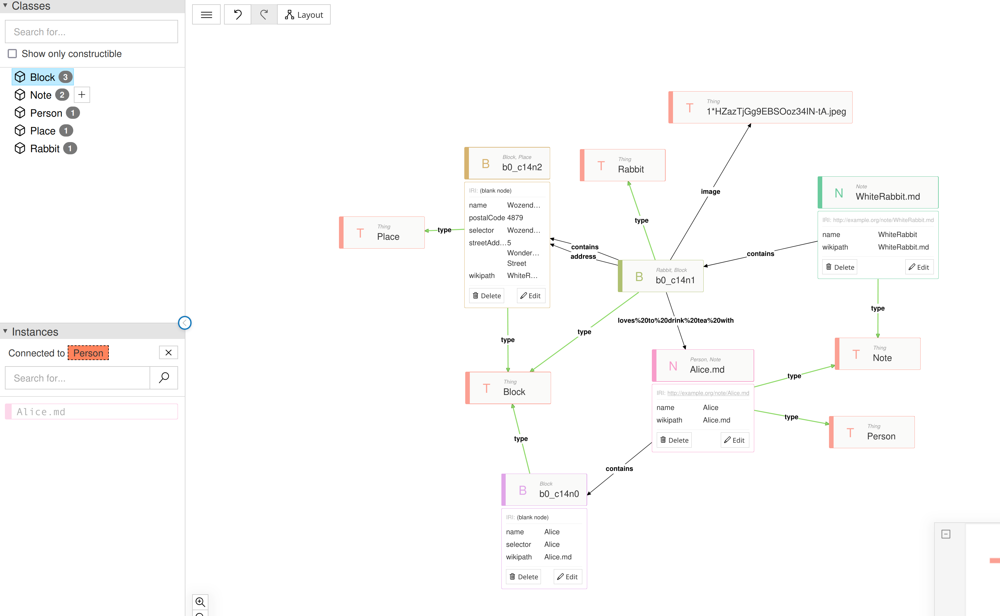

How does it look like?

-  [vault-triplifier](https://github.com/cristianvasquez/vault-triplifier)
-  [reactodia-workspace](https://github.com/reactodia/reactodia-workspace)

- I can discover things wonderfuly
- I cannot change colors or shape of the objects drawn,but not enough for thinking tool. 
- A [tldraw](https://github.com/tldraw/tldraw) version could be neat
